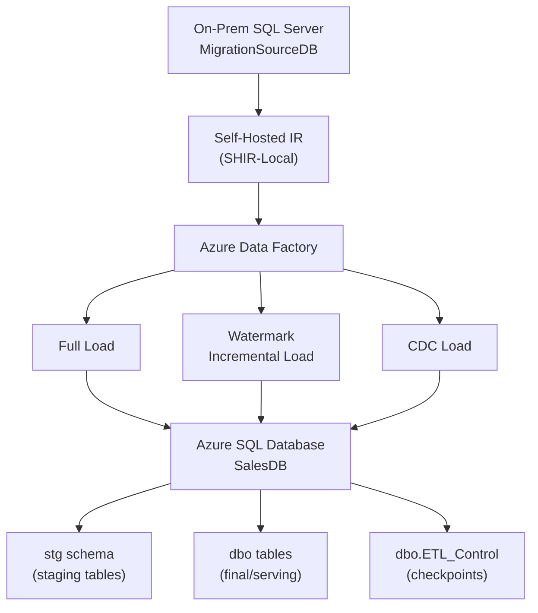

# On-Premises SQL Server to Azure SQL Database Migration (Project 1)

## 1. Project Overview

This project migrates a sample sales database from an on-premises SQL Server instance to Azure SQL Database using Azure Data Factory (ADF) and a Self-Hosted Integration Runtime (SHIR). It implements three complementary load patterns: a one-time full load, a watermark-based incremental load for inserts/updates, and a Change Data Capture (CDC)-based load for row-level inserts, updates, and deletes.

## 2. Business / Technical Problem

Many organizations still run core transactional systems on-premises but want their data available in the cloud for downstream analytics, reporting, or further processing. Moving that data reliably means solving a few concrete problems:

- Getting a full copy of the data into Azure the first time.
- Keeping it in sync afterward without re-copying everything on every run.
- Capturing deletes, which a simple "changed since last run" filter cannot see.
- Making reruns safe — if a pipeline run fails partway, the next run should not create duplicates or skip data.

## 3. Objectives

- Stand up a realistic on-prem-to-cloud migration using Azure-native tooling (ADF + SHIR).
- Implement and clearly separate three load strategies: full, watermark incremental, and CDC.
- Track pipeline progress with an explicit, queryable checkpoint table (`ETL_Control`) rather than relying on ADF state alone.
- Make the pipelines idempotent and restartable using staging tables and `MERGE`.
- Validate results manually with SQL and ADF's built-in monitoring — no separate validation pipeline.

## 4. Architecture

**Source:** On-premises SQL Server, database `MigrationSourceDB`, tables `Customers`, `Products`, `Orders`, `OrderItems`.

**Integration:** Azure Data Factory, connecting to the source through a Self-Hosted Integration Runtime (`SHIR-Local`).

**Target:** Azure SQL Database, database `SalesDB`.

**Pipelines:** `PL_Full_Load`, `PL_Incremental_Load`, `PL_CDC_Load`.

There is **no separate validation pipeline** in this project. Validation is performed manually with SQL queries and ADF's built-in monitoring (see [Testing Performed](#23-testing-performed) and [Monitoring](#24-monitoring)).

## 5. Architecture Diagram



- ADF is the ingestion/migration engine for this project.
- SHIR bridges ADF to the on-prem SQL Server — Azure cannot reach it directly.
- The watermark pipeline handles normal incremental inserts/updates.
- CDC handles row-level change capture, including deletes.
- Azure SQL is the target/serving database.

This project does **not** use Databricks, ADLS, Synapse, Power BI, Delta/DAB, Azure DevOps, Event Hubs, or Kafka — those belong to other projects.

## 6. Technology Stack

| Layer | Technology |
|---|---|
| Source database | SQL Server (on-premises) |
| Change tracking (source) | SQL Server CDC, `ModifiedDate` watermark column + triggers |
| Integration | Azure Data Factory, Self-Hosted Integration Runtime |
| Target database | Azure SQL Database |
| Load/merge logic | T-SQL stored procedures (`MERGE`) |
| Checkpointing | Custom `dbo.ETL_Control` table |

## 7. Source Database

`MigrationSourceDB` on the local SQL Server instance, containing four related tables representing a simple sales domain (customers, products, orders, and order line items). Every table has a `ModifiedDate` column, kept current on updates by AFTER-UPDATE triggers (see [Watermark Design](#17-watermark-design)).

## 8. Data Model

| Table | Key Columns | Notes |
|---|---|---|
| `Customers` | `CustomerID` (PK) | `CustomerName`, `Email`, `City`, `State`, `ModifiedDate` |
| `Products` | `ProductID` (PK) | `ProductName`, `Category`, `Price` (>= 0), `ModifiedDate` |
| `Orders` | `OrderID` (PK), `CustomerID` (FK → Customers) | `OrderDate`, `Status`, `TotalAmount` (>= 0), `ModifiedDate` |
| `OrderItems` | `OrderItemID` (PK), `OrderID` (FK → Orders), `ProductID` (FK → Products) | `Quantity` (> 0), `UnitPrice` (>= 0), `ModifiedDate` |

Row counts in the sample data: ~5,000 customers, ~1,000 products, ~20,000 orders, ~60,000 order items.

## 9. Source Data Generation

Sample data is provided as CSV files in `/Data` (`customers.csv`, `products.csv`, `orders.csv`, `order_items.csv`) and loaded into the source tables with `BULK INSERT` (`Source_Scripts/03_load_data.sql`).

## 10. Azure Resources

- **Azure Data Factory** — orchestrates all three pipelines.
- **Self-Hosted Integration Runtime (SHIR-Local)** — registered against the ADF instance, installed on/near the on-prem SQL Server so ADF can reach it.
- **Azure SQL Database (`SalesDB`)** — target database.

No other Azure services are part of this project.

## 11. ADF Linked Services

| Name | Connects to | Integration Runtime |
|---|---|---|
| `LS_SQLServer_OnPrem` | `MigrationSourceDB` | Self-Hosted IR (`SHIR-Local`) |
| `LS_AzureSQL` | `SalesDB` | Azure-managed / default |

Full details: [`ADF/ADF_BUILD_NOTES.md`](ADF/ADF_BUILD_NOTES.md).

## 12. ADF Datasets

| Name | Linked Service | Notes |
|---|---|---|
| `DS_SQLServer_OnPrem` | `LS_SQLServer_OnPrem` | No fixed table; queries supplied dynamically per activity |
| `DS_AzureSQL` | `LS_AzureSQL` | Parameterized: `SchemaName`, `TableName` → `Schema = @dataset().SchemaName`, `Table = @dataset().TableName` |

## 13. Pipeline 1 — Full Load

`PL_Full_Load`: `ForEach` over the four tables → `Copy_Table` (source → target, full copy). Establishes the initial baseline. Full details: [`ADF/PL_Full_Load.md`](ADF/PL_Full_Load.md).

## 14. Pipeline 2 — Incremental Load

`PL_Incremental_Load`: `Lookup_Control` → `ForEach_Table` → `Lookup_NewWatermark` → `Copy_To_Staging` → `SP_Merge` → `SP_Update_Control`. Detects INSERT/UPDATE via `ModifiedDate`. Full details: [`ADF/PL_Incremental_Load.md`](ADF/PL_Incremental_Load.md).

## 15. Pipeline 3 — CDC Load

`PL_CDC_Load`: `Lookup_Control` → `Lookup_MaxLSN` → `ForEach_Table` → `If_HasChanges` → (`Copy_CDC_To_Staging` → `SP_CDC_Merge` → `SP_Update_Control`). Detects INSERT/UPDATE/DELETE via SQL Server CDC. Full details: [`ADF/PL_CDC_Load.md`](ADF/PL_CDC_Load.md).

## 16. Watermark Design

Every source table has a `ModifiedDate` column, defaulted to `SYSUTCDATETIME()` on insert and refreshed by an AFTER-UPDATE trigger on every update (`Source_Scripts/02_watermark_triggers.sql`). `PL_Incremental_Load` filters `ModifiedDate > LastWatermark AND ModifiedDate <= NewWatermark`, copies matching rows to staging, merges into `dbo`, then advances `LastWatermark` in `ETL_Control` — but only after the merge succeeds. Watermark alone **cannot** detect deletes.

## 17. CDC Design

SQL Server CDC is enabled on the source database and all four tables (`Source_Scripts/04_enable_cdc.sql`). `PL_CDC_Load` compares the source's current max LSN against each table's stored `LastProcessedLSN`; if they differ, it reads net changes since the last processed LSN via `cdc.fn_cdc_get_net_changes_dbo_<Table>`, tags each row `I`/`U`/`D`, stages it, and merges accordingly. CDC exists only on the source — Azure SQL never generates or queries LSNs itself, it only stores the last **processed** one.

## 18. ETL_Control Design

`dbo.ETL_Control` (Azure SQL) holds one row per table with:

| Column | Updated by | Purpose |
|---|---|---|
| `LastWatermark` | `PL_Incremental_Load` only | Watermark checkpoint |
| `LastProcessedLSN` | `PL_CDC_Load` only | CDC checkpoint |
| `ColumnList` | Set once at setup | Column list used to build the CDC net-changes SELECT per table |
| `LastRunStatus`, `LastRunTime` | Both pipelines | Last successful run info |

`LastWatermark` and `LastProcessedLSN` are two **independent** checkpoints and are never merged into a single concept — a table can have one advance without the other.

## 19. Staging Design

Each target table has a matching `stg.<Table>` staging table with an added `CDC_Operation CHAR(1)` column:

| Value | Meaning |
|---|---|
| `NULL` | Normal / full / watermark staging (no operation flag) |
| `I` | CDC INSERT |
| `U` | CDC UPDATE |
| `D` | CDC DELETE |

Staging tables are truncated and reloaded on every run (no keys required — see `Target_Scripts/03_create_staging_tables.sql`).

## 20. MERGE / Idempotency

Two sets of stored procedures process staged rows:

- **Watermark merge** (`usp_Merge_*`): match → update, no match → insert. No delete semantics (watermark can't see deletes).
- **CDC merge** (`usp_CDC_Merge_*`): `CDC_Operation = 'D'` → delete, `'U'` → update, `'I'` → insert.

Because both use key-based `MERGE`, reprocessing the same staged rows twice produces the same end state — this is what makes reruns after a failure safe.

## 21. Retry and Recovery

Two independent mechanisms work together:

1. **Activity retry** — Copy activity retry = 1, interval 30 seconds. Handles transient failures within a single run.
2. **Checkpoint recovery** — the checkpoint (`LastWatermark` or `LastProcessedLSN`) only advances after `usp_Update_Control` runs, which only happens after the merge succeeds. If a run fails before that point, the checkpoint stays at its last successful value, and the next run reprocesses the same window safely because `MERGE` is idempotent.

Activity retry alone does **not** make the pipeline restartable — it's the combination of checkpoint-after-merge plus idempotent `MERGE` that does.

## 22. Testing Performed

- **INSERT test** — inserted a new row on the source, ran `PL_CDC_Load`, confirmed the row appeared in the target.
- **UPDATE test** — updated a known row (e.g., a customer's `City`) on the source, ran the relevant pipeline, confirmed the same `CustomerID`/`City`/`ModifiedDate` on both sides.
- **DELETE test** — deleted a row on the source, ran `PL_CDC_Load`, confirmed the row was absent from both source and target (watermark load cannot do this — CDC only).
- **Failure/retry test** — deliberately interrupted a run before `SP_Update_Control`, confirmed the checkpoint did not advance, reran the pipeline, confirmed the same window was safely reprocessed with no duplicates.

See `Source_Scripts/05_source_test_changes.sql` for the test script used to generate known changes.

## 23. Monitoring

Verified through ADF Monitor for each pipeline run: overall pipeline success/failure, per-activity duration, rows read/written on Copy activities, retry attempts, and error details on any failed run.

## 24. Screenshots / Evidence

| File | What it proves |
|---|---|
| `Screenshots/azure_sql.png` | Azure SQL Database (`SalesDB`) connection is live and reachable |
| `Screenshots/shirl.png` | Self-Hosted Integration Runtime is registered and running |
| `Screenshots/linked_service.png` | Both linked services (`LS_SQLServer_OnPrem`, `LS_AzureSQL`) are configured |
| `Screenshots/full_load.png` | `PL_Full_Load` ran successfully — four `Copy_Table` activities via `ForEach1` |
| `Screenshots/incremental_load.png` | `PL_Incremental_Load` ran successfully — `Lookup_Control` → `ForEach_Table` chain with `SP_Merge`/`SP_Update_Control` |
| `Screenshots/cdc_load.png` | `PL_CDC_Load` ran successfully — `Lookup_Control` → `Lookup_MaxLSN` → `ForEach_Table` with `SP_CDC_Merge`/`SP_Update_Control_CDC` |
| `Screenshots/control_before.png` | `ETL_Control` state before a pipeline run |
| `Screenshots/control_after.png` | `ETL_Control` state after a pipeline run, showing the checkpoint advanced |
| `Screenshots/source_sql_server.png` | On-prem SQL Server connection to `MigrationSourceDB` (supplementary evidence) |

## 25. Repository Structure

```
Migration project/
|
+-- Data/
|   +-- customers.csv
|   +-- products.csv
|   +-- orders.csv
|   +-- order_items.csv
|
+-- Source_Scripts/
|   +-- 01_create_source_schema.sql
|   +-- 02_watermark_triggers.sql
|   +-- 03_load_data.sql
|   +-- 04_enable_cdc.sql
|   +-- 05_source_test_changes.sql
|
+-- Target_Scripts/
|   +-- 01_create_target_tables.sql
|   +-- 02_create_control_table.sql
|   +-- 03_create_staging_tables.sql
|   +-- 04_watermark_merge_procedures.sql
|   +-- 05_update_control_procedure.sql
|   +-- 06_cdc_merge_procedures.sql
|   +-- 07_get_source_watermarks.sql
|   +-- 08_initialize_cdc_baseline.sql
|
+-- ADF/
|   +-- PL_Full_Load.md
|   +-- PL_Incremental_Load.md
|   +-- PL_CDC_Load.md
|   +-- ADF_BUILD_NOTES.md
|
+-- Screenshots/
|   +-- full_load.png
|   +-- incremental_load.png
|   +-- cdc_load.png
|   +-- control_before.png
|   +-- control_after.png
|   +-- linked_service.png
|   +-- shirl.png
|   +-- azure_sql.png
|   +-- source_sql_server.png
|
+-- README.md
+-- CORRECTIONS.md
```

## 26. Rebuild Instructions (Runbook)

1. Create `MigrationSourceDB` (`Source_Scripts/01_create_source_schema.sql`).
2. Create the four source tables (included in step 1).
3. Add `ModifiedDate` triggers (`Source_Scripts/02_watermark_triggers.sql`).
4. Generate/load CSV data (`Source_Scripts/03_load_data.sql`) — update the file path first.
5. Verify source row counts (included in step 4's script).
6. Enable CDC on the source database/tables (`Source_Scripts/04_enable_cdc.sql`).
7. Confirm SQL Server Agent is running (required for CDC capture/cleanup jobs).
8. Create Azure SQL `SalesDB`.
9. Create target tables (`Target_Scripts/01_create_target_tables.sql`).
10. Create `ETL_Control` (`Target_Scripts/02_create_control_table.sql`).
11. Create staging schema/tables (`Target_Scripts/03_create_staging_tables.sql`).
12. Create MERGE procedures (`Target_Scripts/04_watermark_merge_procedures.sql`).
13. Create `usp_Update_Control` (`Target_Scripts/05_update_control_procedure.sql`).
14. Create CDC merge procedures (`Target_Scripts/06_cdc_merge_procedures.sql`).
15. Create the Azure Data Factory instance.
16. Install/register `SHIR-Local`.
17. Create linked services (`LS_SQLServer_OnPrem`, `LS_AzureSQL`).
18. Create datasets (`DS_SQLServer_OnPrem`, `DS_AzureSQL`).
19. Build `PL_Full_Load` and run it to establish the baseline.
20. Establish the watermark baseline (see `Target_Scripts/07_get_source_watermarks.sql` as reference).
21. Build `PL_Incremental_Load`.
22. Establish the CDC baseline LSN from the **source** (`Target_Scripts/08_initialize_cdc_baseline.sql`) — generate a fresh LSN, do not reuse the one in this repo's scripts/screenshots.
23. Build `PL_CDC_Load`.
24. Test INSERT/UPDATE/DELETE (`Source_Scripts/05_source_test_changes.sql`).
25. Test failure/retry behavior.
26. Capture screenshots.
27. Delete the Azure resources after the demo if cost control matters (see [Cleanup / Cost Notes](#30-cleanup--cost-notes)).

**Rebuild rule:** don't copy the old runtime LSN or `LastWatermark` values from this repo into a new build — generate fresh ones on the source, and let the first full load establish a clean baseline for the new run.

## 27. Project Flow (Lifecycle Summary)

**A. Initial Setup** — create source, generate/load data, enable CDC, create Azure SQL target, create `ETL_Control`, create staging.

**B. Baseline** — full load, capture initial watermark, capture initial CDC baseline LSN.

**C. Normal Operations** — watermark pipeline handles INSERT/UPDATE, CDC pipeline handles INSERT/UPDATE/DELETE.

**D. Recovery** — checkpoints update only after a successful merge; failed windows can be safely reprocessed on the next run.

## 28. Cleanup / Cost Notes

Azure SQL Database and Azure Data Factory both incur ongoing cost while provisioned. After demoing or capturing evidence, delete the Azure SQL Database and the Data Factory instance (or at minimum pause/scale the database down) if cost control matters. The on-prem SQL Server and SHIR installation are local and don't carry Azure cost.
